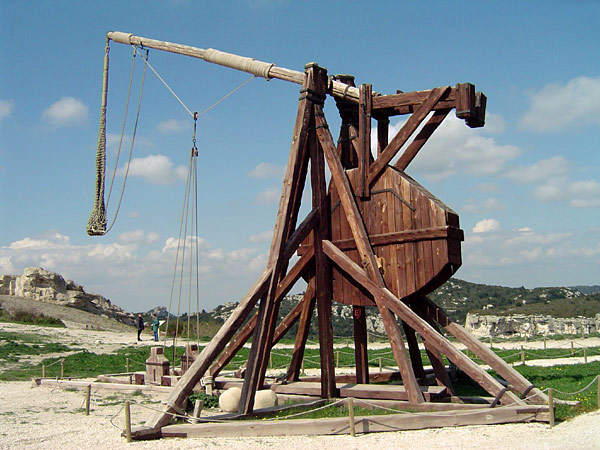

# siegeNgin - trebuchet -

Walls are meant to be broken.

ブラウザを介しコラボレーションツールを利用してAIとの協働を行うツールです。
UIで簡単にAIとの意思疎通を可能にします。

*A trebuchet at Château de Castelnaud (Image: [ChrisO](https://commons.wikimedia.org/wiki/User:ChrisO), [CC BY-SA 3.0](https://creativecommons.org/licenses/by-sa/3.0), via Wikimedia Commons)*

## 特徴

- **ブラウザベースのUI** - コマンドライン不要
- **マスター自動判定** - コミニュケーションツールを利用したユーザ判定
- **インターフェース自動生成** - インターフェースファイルを自動出力

## 名前の由来

中世ヨーロッパで使われた「siege engine」（攻城兵器）は、
難攻不落の城を攻略するための投石機やカタパルトでした。
この攻城兵器を操作する技術者を「ingeniator」と呼び、
これが現代の「engineer」（エンジニア）の語源となっています。

AIとの協働によるソフトウェア開発は、その意思疎通の困難さによって人類にとってまるで難攻不落の「要塞」のようです。
コマンドライン、設定ファイル、データベース、ネットワーク...これらの壁を乗り越えるのは大変な作業です。
siegeNginは、これら現代の要塞を攻略するための 新時代の「攻城兵器」として開発されました。
誰もが簡単にブラウザベースのコラボレーションツールを利用てAIと意思疎通できる世界を実現します。

AI開発の参入障壁という「城壁」を打ち破り、
より多くの開発者がAIとの協働の世界に参加できることを願って、
このツールは作られました。

エンジニアの語源に立ち返り、複雑な技術的障壁を打ち破る
― それがsiegeNginに込められた想いです。
