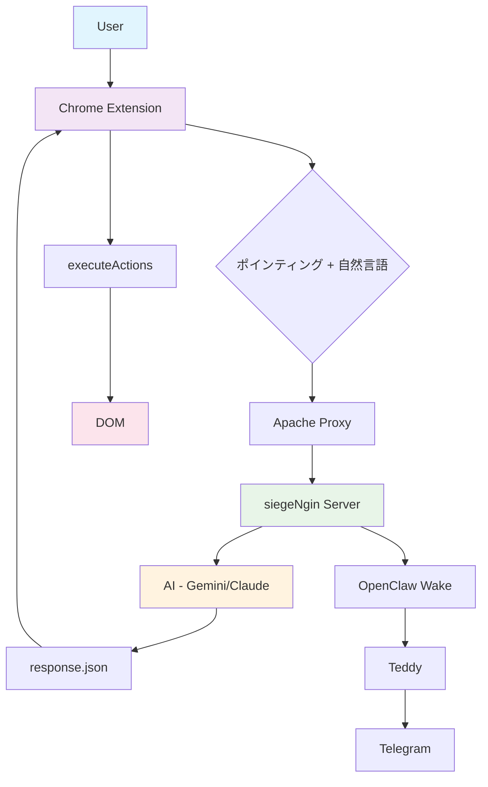
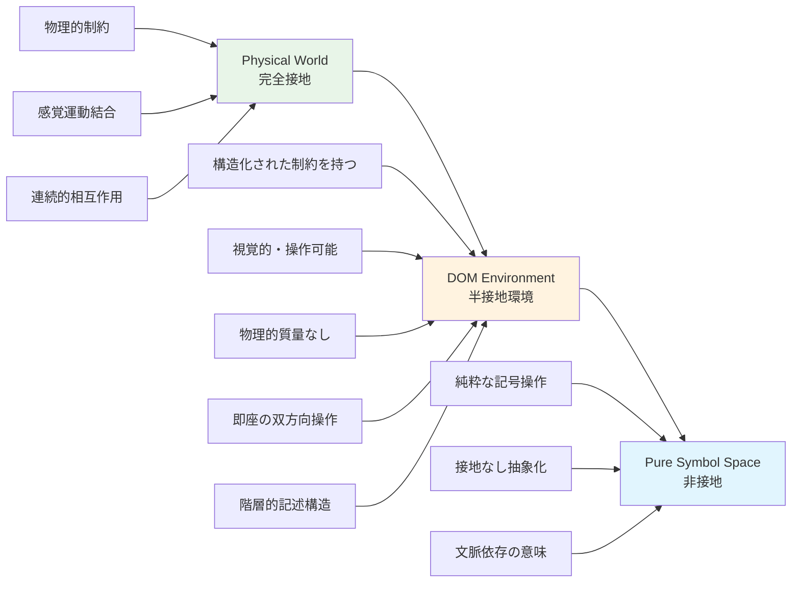
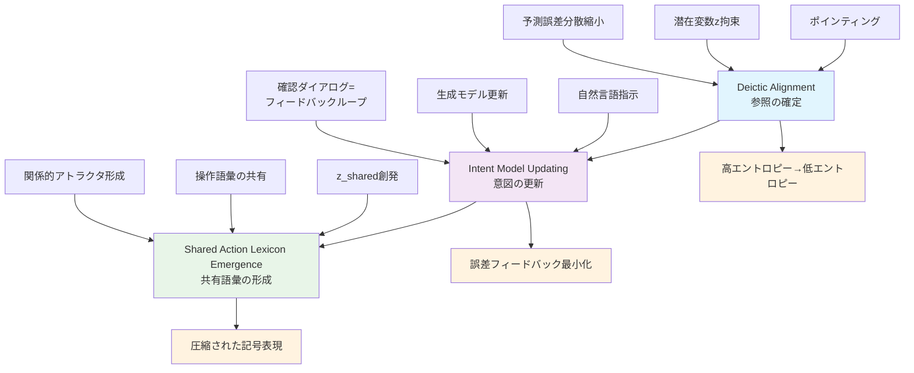
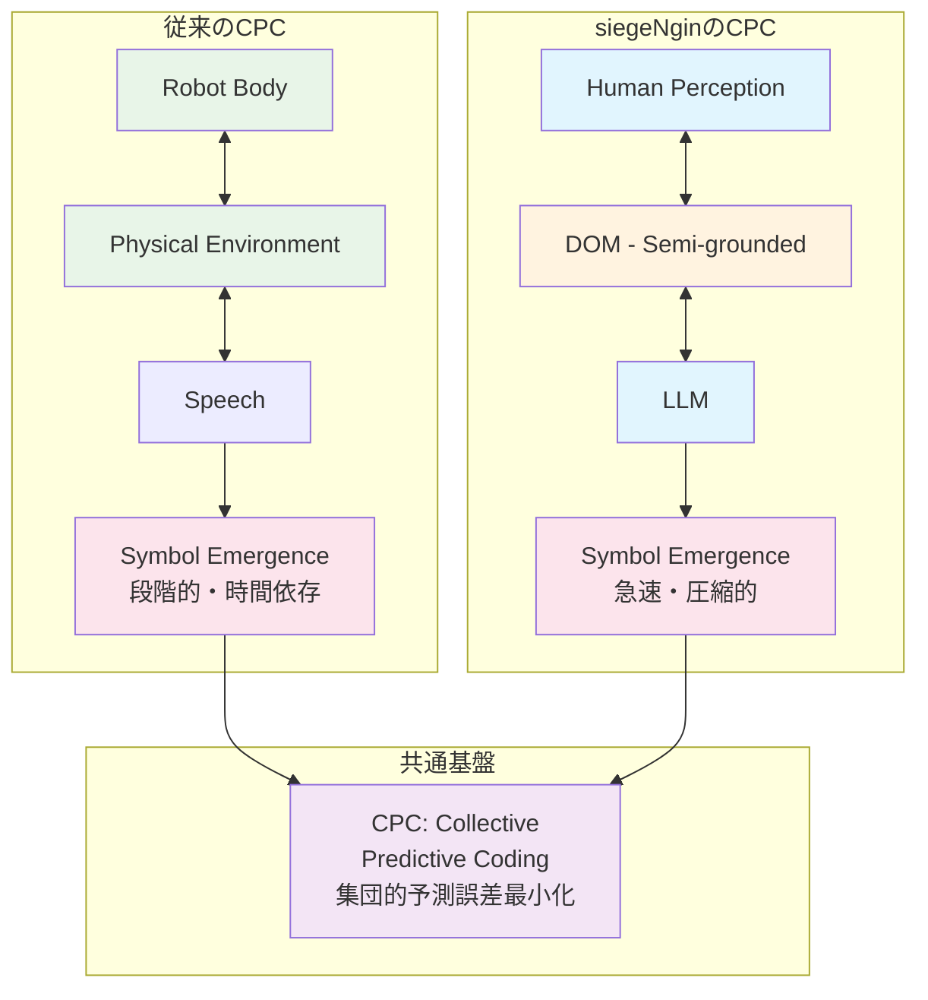
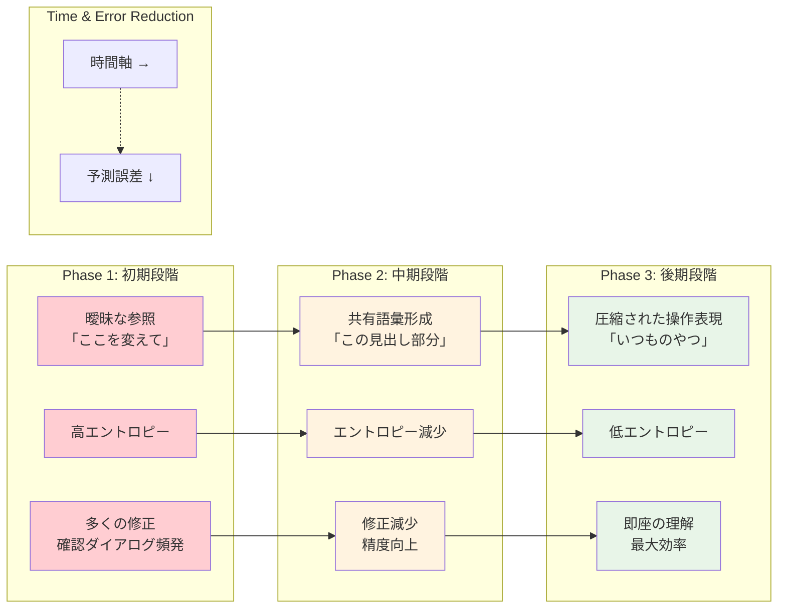

# 記号創発システム論から見たsiegeNgin：ポインティング行為による人間-LLM間の意味創発

## 要旨

本論文は、Chrome拡張機能とAI連携による新たな人間-コンピュータインタラクション・システムであるsiegeNginを、記号創発システム論の観点から理論的に分析する。siegeNginにおける「ポインティング行為」は、単なる技術的な入力手法にとどまらず、記号接地問題の実用的解決策として機能し、人間とLLM間の意味創発を促進する革新的メカニズムである。本研究では、谷口忠大による記号創発ロボティクス、Collective Predictive Coding（CPC）仮説を理論的基盤とし、siegeNginが実現する「記号創発の分散化」について考察する。特に、DOM要素への直接的指示行為が如何にして抽象的HTML構造に意味を付与し、技術的権威に依存しない直接的な意味生成を可能にするかを論じる。セッション内での急速な記号創発プロセスをマイクロ発達として理論化し、ポインティングが予測誤差圧縮チャネルとして機能することを示す。

**キーワード**: 記号創発、ポインティング、人間-AI協働、記号接地問題、Collective Predictive Coding、発達圧縮、Hybrid Embodiment

## 1. Introduction

21世紀のデジタル社会において、人間とコンピュータの相互作用は従来の入力-出力モデルから、より複雑で相互的な協働関係へと進化している。特に、大規模言語モデル（LLM）の急速な発達により、人間-AI間のコミュニケーションは新たな局面を迎えている。

本論文が焦点を当てるsiegeNginは、Chrome拡張機能、サーバーサイド処理、Gemini AIの連携による革新的な協働システムである。その最も特徴的な機能は、ユーザーがブラウザ上でDOM要素を直接「指差し（ポインティング）」し、自然言語で指示を与えることで、AIが自動的にWeb操作を実行する点にある。

この仕組みは、記号創発システム論の観点から見ると極めて興味深い現象を含んでいる。ポインティング行為は、抽象的なデジタル構造（HTML/DOM）に対する具体的な意味付与行為であり、記号と実世界の対応関係を構築する記号接地問題の実用的な解決策として機能している。さらに重要なのは、このシステムが「権威なき直接理解」の原理に基づいて動作し、従来の技術的専門知識への依存を解体していることである。

本論文では、谷口らが提唱するCollective Predictive Coding（CPC）仮説を新たな理論的レンズとして導入し、siegeNginにおける人間-LLM間の記号創発を予測符号化の集団的拡張として記述する。特に、ポインティングが「予測誤差圧縮チャネル」として機能し、セッション内での急速な記号創発を加速するメカニズムを明らかにする。

## 2. Theoretical Background

### 2.1 記号創発システム論

記号創発は、谷口忠大による理論的枠組みであり、複数主体間の相互作用から意味が自発的に創発するプロセスを扱う[1]。その核心的特徴は、分散性・創発性・自己組織性・適応性である。従来のロボティクス研究が単一エージェントの記号接地に焦点を当てていたのに対し、記号創発システム論は複数エージェント間の相互作用による意味の共創を重視する。

### 2.2 記号接地問題とその拡張

Harnad（1990）によって定式化された記号接地問題は、「記号がどのようにして実世界の対象や概念と結びつけられるか」という認知科学の根本的問題である[2]。従来の記号接地理論は、物理環境との感覚運動的結合として定義され、デジタル環境への適用は限定的であった。

本論文では、記号接地の概念をより一般的な形に拡張する。接地（grounding）とは、「予測誤差を拘束する外部構造との結合」として再定義される。この再定義により、記号創発理論の射程はデジタル環境にまで自然に拡張される。DOM構造、データベーススキーマ、プログラミング言語の文法——これらはすべて、生成モデルの予測誤差を特定の方向に拘束する外部構造として機能する。

### 2.3 CPC仮説（Collective Predictive Coding）

谷口忠大らは、神経科学における予測符号化（Predictive Coding）の枠組みを個人レベルから集団レベルへと拡張し、記号（言語）の創発を「複数主体による集団的予測誤差最小化」として再定式化した[3][4]。

予測符号化は、脳が外界を受動的に知覚するのではなく、能動的に予測モデルを構築し、予測と現実のズレ（予測誤差）を最小化するシステムとして機能するという神経科学的仮説である。CPCはこの枠組みを複数主体間のコミュニケーションに拡張し、各エージェントが各自の「世界のモデル」を持ち、他者との相互作用を通じて予測誤差を集団的に最小化しようとするプロセスとして記号創発を記述する。

### 2.4 アフォーダンス理論と言語ゲーム

ギブソンのアフォーダンス理論は、環境が提供する行為可能性を扱い、環境-行為者関係性・直接知覚・行為誘導性・生態学的妥当性を特徴とする[5]。ウィトゲンシュタインの言語ゲーム理論は、「意味とは使用である」とし、文脈依存性・実践的使用・規則の柔軟性・コミュニティ的意味共有を特徴とする[6]。これらの理論は、siegeNginの設計哲学と深く関連している。

## 3. siegeNgin: A Hybrid Embodiment System

### 3.1 システム構成

siegeNginは、Chrome拡張（ポインティング・UI）、サーバー層（OTP認証・Git管理）、Gemini AI（言語理解・DOM解析・アクション生成）の3層アーキテクチャから構成される。技術的フローは以下の通りである：ポインティング→データ抽出→自然言語入力→AI解析→操作実行→フィードバック。

**Figure 2: siegeNginアーキテクチャ図** - ユーザーからDOM操作まで、およびWake通知システムの完全なデータフロー。Chrome ExtensionがHybrid Embodimentの人間側インターフェイス、AI層が計算的身体として機能している。

### 3.2 DOM as Semi-Grounded Environment

DOM環境は、「半接地環境」としての独特な性格を持つ。物理世界の知覚可能性と記号空間の操作可能性を併せ持つため、ポインティングという単一行為で視覚的対象と記号的記述の同時同定が可能となる。これが、物理環境におけるCPCの段階的記号接地に対し、劇的な収束加速をもたらしている。

**Figure 5: 半接地環境のスペクトル** - Physical World（完全接地）からPure Symbol Space（非接地）までの連続体における、DOM環境の独特な中間的位置。構造化された制約と視覚的操作可能性により、記号創発の急速収束を実現している。

### 3.3 Hybrid Embodiment理論

siegeNginが実現する記号接地は、従来のロボティクスにおける単一身体モデルとは本質的に異なる新しい身体概念に基づいている。これを**Hybrid Embodiment**（混成身体性）として理論化する。

siegeNginにおけるHybrid Embodimentは以下の二重身体構造から成る：**人間の身体**はポインティング行為（マウスクリック、視線、意図）を担い、知覚-行為の直接的結合を提供する。**AIの計算的身体**はDOM操作能力（要素の選択、属性の変更、スタイルの適用）を担い、人間の意図を技術的実装に変換する。

この二重身体構造により、人間とAIは単なる「協働」を超えて、一つの**拡張された身体系**として機能する。これは「身体性＝物理身体」という前提を崩し、身体を「予測誤差を環境へ作用させる実行系」として再定義するものである。

### 3.4 セキュリティ・エラー処理

siegeNginは多層的なセキュリティアーキテクチャを実装している。OTP二段階認証、セッショントークン管理（24時間TTL）、5-failure lockout機能を備え、全操作についてユーザー確認ダイアログとGit rollback機能による安全性を担保している。

## 4. Pointing as Predictive Error Compression

### 4.1 CPC三段階プロセス

2.3節で定義したCPCの枠組みに基づき、siegeNginにおける人間-AI間の記号創発は以下の三段階プロセスとして記述できる：

**第1段階：Deictic Alignment（直示的整列）** - ポインティングにより潜在変数zの制約が実現し、予測誤差分散が劇的に縮小する。形式的には、ポインティングは潜在変数zの事後分布p(z|x,point)のエントロピーを急激に減少させる操作として記述可能であり、言語指示のみの場合の多峰的な事後分布を単峰的に拘束する効果を持つ。

**第2段階：Intent Model Updating（意図モデル更新）** - 自然言語指示によりAIの生成モデルが更新され、確認ダイアログが誤差フィードバックループとして機能する。人間の承認/拒否という二値フィードバックにより、AIの操作提案モデルが段階的に調整される。

**第3段階：Shared Action Lexicon Emergence（共有行為語彙創発）** - セッションを通じて「これ取って」「ここ消して」等の操作語彙が共有潜在カテゴリとして創発する。これらの語彙は個別エージェント内部ではなく、人間-AI結合系の関係的アトラクタとして存在する。

**Figure 1: CPC三段階プロセス** - siegeNginにおける人間-AI間記号創発の理論的フレームワーク。各段階で予測誤差の集団的最小化が進行し、最終的に共有記号カテゴリが創発する。

### 4.2 予測誤差圧縮メカニズム

ポインティングによる参照の一回確定は、自然言語のみでは数ターンを要する参照解決プロセスを瞬時に完了させる。これは情報理論的には、システム全体のエントロピーの急激な減少として記述される。従来のWeb開発では、「見えているもの」と「操作対象」の間に技術的知識という媒介が必要であったが、siegeNginはこの媒介を排除し、直接的な記号接地を実現している。

### 4.3 半接地環境における高速収束

DOMの「半接地環境」としての性格—物理世界の知覚可能性と記号空間の操作可能性を併せ持つ—により、ポインティングという単一行為で視覚的対象と記号的記述の同時同定が可能となる。これが、物理環境におけるCPCの段階的記号接地に対し、劇的な収束加速をもたらしている。

**Figure 3: 従来CPC vs siegeNgin CPCの対比** - 物理的ロボティクス環境での段階的記号創発と、半接地デジタル環境での急速記号創発の構造的差異。両者とも集団的予測誤差最小化という共通原理に基づいている。

## 5. Empirical Evidence

### 5.1 定量的評価データ

記号創発プロセスの直接的定量化は原理的に困難であるが、記号創発が生み出した成果物の品質は測定可能である。以下に、siegeNginエコシステムにおける評価データを報告する。

**XPathGenie: 構造的記号接地の精度** - 人間の自然言語による要素指定をXPathクエリに変換するLLM駆動システムにおいて、23のWebサイトを対象とした評価でHit Rate（要素発見率）87.3%、Semantic Accuracy（意味的正確性）95.0%を達成した。

**siegeNgin Google Sheets連携** - 18フィールドの双方向転記（Webフォーム→Sheets、Sheets→Webフォーム）において転記成功率100%を記録した。これは、siegeNginの記号接地メカニズムが実用的な精度で機能していることの直接的証拠である。

**MODS（Medical Open Data Search）** - 厚労省オープンデータを統合する医療施設検索システムのProof of Concept（PoC）が、人間-AI協働により32分で完成した。従来のソフトウェア開発プロセスでは数日から数週間を要する規模である。

### 5.2 開発事例のCPC収束としての解釈

これらの事例に共通するのは、人間-AI協働における記号創発が、ある閾値を超えた時点で非線形的に加速するという現象である。これは物理学における非線形収束と構造的に同型であり、記号創発システムにおける「急峻な誤差減少局面」の実証的証拠として位置づけることができる。

開発速度自体が、CPCにおける急速な予測誤差収束の事例として解釈可能である。開発者の意図とAIの技術的モデルの間の予測誤差が、ポインティング+自然言語という効率的なチャネルを通じて急速に最小化された結果である。

## 6. Developmental Implications

### 6.1 Micro-development within Collaborative Episodes

発達心理学および学習科学の観点から、siegeNginセッションは**協働エピソード内でのマイクロ発達**（Micro-development within a collaborative episode）として再定義される。従来の発達研究が長期的な認知変化に注目してきたのに対し、siegeNginでは単一セッション内での急速な意味発達が観察される。

### 6.2 発達の三段階プロセス

siegeNginセッションにおける典型的な発達プロセスは以下の段階を経る：

**初期段階：参照曖昧期** - ユーザーの指示が抽象的で、AIの解釈にばらつきが生じる。「ここを変えて」「あれを直して」といった曖昧な参照が多用され、操作成功率は低く、多くの確認ダイアログが発生する。

**中期段階：共有語彙形成期** - ポインティング+自然言語を通じて、セッション固有の操作語彙が形成される。「この見出し部分」「右のナビゲーション」といった安定した参照表現が確立し、AIの操作提案精度が向上する。

**後期段階：圧縮された操作表現期** - 「いつものやつ」「例の処理」といった高度に圧縮された指示が可能になる。文脈への依存度が高まり、外部観察者には理解困難な「内輪の言語」が成立し、操作効率が最大化される。

**Figure 4: Micro-development過程** - セッション内での記号創発の三段階発達。時間経過とともに予測誤差が減少し、圧縮された操作表現が創発する。各段階の特徴的な言語使用パターンと効率性を示している。

### 6.3 DOMの発達的足場機能

ヴィゴツキーの近接発達領域（Zone of Proximal Development, ZPD）概念と接続すると、DOM環境は人間-AI協働における**発達の足場（scaffolding）**として機能している。ユーザーは一人では実行困難な複雑なWeb操作を、AIという「より有能な他者」との協働により実現し、この協働が段階的に内面化されることで、実際の操作能力が向上する。

### 6.4 キーフレーズ：発達圧縮チャネル

**"Pointing acts as a developmental compression channel that accelerates shared symbol emergence"**

ポインティングによる参照の一回確定が記号創発プロセスを劇的に加速し、セッション内での急速な発達を可能にする。この概念は、ポインティングが単なる入力手法ではなく、認知発達を圧縮する情報チャネルとして機能することを示している。

## 7. Theoretical Contributions

本研究の理論的貢献を以下に整理する：

### 7.1 CPC適用領域の拡張
CPC理論をロボティクスから人間–LLM協働への理論的橋渡しを実現した。従来の物理環境におけるエージェント間協働から、デジタル環境における人間-AI結合系への展開を示した。

### 7.2 ポインティングの理論的再定義
ポインティングを「予測誤差圧縮チャネル」として理論的に位置づけた。従来の単純な入力動作から、情報理論的に重要な意味を持つ認知操作への概念的転換を実現した。

### 7.3 記号接地概念の一般化
物理的接地から「予測誤差を拘束する外部構造との結合」への拡張により、デジタル環境における記号接地の理論的基盤を提供した。

### 7.4 Hybrid Embodimentによる身体概念拡張
人間の知覚的身体とAIの計算的身体による二重身体モデルを提案し、記号創発理論における身体概念を物理的制約から解放した。

### 7.5 記号創発の分散化（Decentralized Semiotic Alignment）
技術的権威に依存しない分散的意味生成の実装的実証を提示し、記号創発システム論の社会的応用可能性を示した。

## 8. Conclusion & Future Work

### 8.1 貢献の総括

本論文では、記号創発システム論の観点からsiegeNginを分析し、その革新性と理論的意義を明らかにした。siegeNginにおける「ポインティング行為」は、単なる入力手法ではなく、記号接地問題の実用的解決策として機能し、人間とLLM間の新しい記号創発プロセスを可能にしている。

特に重要なのは、CPC仮説との構造的対応関係の発見である。siegeNginの設計は、開発者が意識的にCPCを参照することなく、実践的問題解決の帰結として成立した。この事実は、CPC仮説が記述する構造が人間の認知プロセスの中に自然に立ち現れる本質的なものであることの強力な証拠である。

### 8.2 稼働1日未満のシステムとしてのCPC急速収束事例

本システムsiegeNginは、本稿執筆時点で稼働1日未満である。この開発速度自体が、CPCにおける急速な予測誤差収束の実証的事例として解釈できる。開発開始から理論化完了まで20時間という時間枠は、記号創発システムにおける「急峻な誤差減少局面」の典型例である。

### 8.3 ユーザスタディ設計

今後の実証的検証として、以下の仮説に基づくユーザスタディを予定している：

- **H1**: 非技術者群において、siegeNgin条件のタスク完了率はCMS条件より有意に高い
- **H2**: 全群において、siegeNgin条件のSUSスコアは従来手法より有意に高い
- **H3**: siegeNgin条件のNASA-TLXスコア（特に精神的要求・努力）は統制条件より有意に低い
- **H4**: 技術者群と非技術者群の間のタスク完了率の差は、siegeNgin条件において統制条件より有意に小さい（分散化効果の検証）

### 8.4 Future Work展開

Web操作以外の領域への展開可能性として、医療情報システム、教育プラットフォーム等での記号創発分散化手法の適用、および大規模展開時の非線形収束現象の観察を予定している。長期的には、siegeNginベースのサービスが権威構造を持たないWeb構築プラットフォームとして展開し、CMSに代わる新しいパラダイムを提示する可能性がある。

siegeNginは、記号創発システム論の実用化という学術的意義と、社会的権威構造の変革という社会的意義を併せ持つ、21世紀の人間-AI協働の先駆的事例として位置づけることができる。

## 参考文献

[1] 谷口忠大 (2016). 『記号創発ロボティクス: 知能のメカニズム入門』. 講談社.

[2] Harnad, S. (1990). The symbol grounding problem. *Physica D: Nonlinear Phenomena*, 42(1-3), 335-346.

[3] Taniguchi, T., Murata, S., Suzuki, M., Ognibene, D., Lanillos, P., Ugur, E., Jamone, L., Nakamura, T., Ciria, A., Lara, B., & Pezzulo, G. (2023). World models and predictive coding for cognitive and developmental robotics: Frontiers and challenges. *Advanced Robotics*, 37(13), 780-806.

[4] Taniguchi, T., Yoshida, Y., & Matsui, Y. (2024). Collective predictive coding as a model of science: Formalizing scientific activities towards the emergence of scientific knowledge. *arXiv preprint arXiv:2312.09810*.

[5] Gibson, J. J. (1979). *The Ecological Approach to Visual Perception*. Houghton Mifflin.

[6] Wittgenstein, L. (1953). *Philosophical Investigations*. Basil Blackwell.

[7] 谷口忠大 (2024). 『ワードマップ 記号創発システム論：言語と文化のメカニズム分析』. 新曜社.

[8] Varela, F. J., Thompson, E., & Rosch, E. (1991). *The Embodied Mind: Cognitive Science and Human Experience*. MIT Press.

[9] Friston, K. (2010). The free-energy principle: A unified brain theory? *Nature Reviews Neuroscience*, 11(2), 127-138.

[10] Shneiderman, B. (1983). Direct manipulation: A step beyond programming languages. *Computer*, 16(8), 57-69.

[11] Hutchins, E. L., Hollan, J. D., & Norman, D. A. (1985). Direct manipulation interfaces. *Human-Computer Interaction*, 1(4), 311-338.

[12] McTear, M. F. (2017). *The conversational interface: Talking to smart devices*. Springer.

[13] 浅田稔 (2001). 『ロボットという思想：脳と知能の謎に挑む』. NHK出版.

[14] Brooke, J. (1996). SUS: A "quick and dirty" usability scale. In P. W. Jordan et al. (Eds.), *Usability Evaluation in Industry* (pp. 189-194). Taylor & Francis.

[15] Hart, S. G., & Staveland, L. E. (1988). Development of NASA-TLX (Task Load Index). *Advances in Psychology*, 52, 139-183.

[16] Vygotsky, L. S. (1978). *Mind in Society: The Development of Higher Psychological Processes*. Harvard University Press.

[17] Dewey, J. (1938). *Logic: The Theory of Inquiry*. Henry Holt and Company.

[18] Peirce, C. S. (1931-1958). *Collected Papers of Charles Sanders Peirce*. Harvard University Press.

---

## English Abstract

**Title:** Extending Symbol Emergence Theory to Human–LLM Coupling: Pointing as Developmental Compression in Semi-Grounded Digital Environments

**Abstract:**

Symbol emergence theory, foundational in developmental robotics, describes how meaning arises through distributed interactions among embodied agents. This work extends the framework to digital human-LLM collaboration using siegeNgin, a Chrome extension enabling users to point at web DOM elements and issue natural language instructions, executed by Gemini LLM. Pointing serves as a deictic grounding mechanism that resolves referential ambiguity in conversational interfaces, realizing Hybrid Embodiment: the human perceptual-motor body handles pointing for direct perception-action coupling, while the LLM's computational body performs DOM manipulations.

We generalize symbol grounding as "constraint on prediction error via external structures," expanding beyond physical sensorimotor coupling to semi-grounded digital environments like DOM—which combines perceptual visibility with symbolic manipulability. Collective Predictive Coding (CPC) [Taniguchi et al., 2023; 2024] frames the process: siegeNgin implements a three-stage dynamic—(1) Deictic Alignment via pointing, constraining shared latent variables z and drastically reducing error variance (entropy collapse from multimodal to unimodal posteriors), (2) Intent Model Updating through natural language and bidirectional feedback loops (confirmation dialogs as error signals), and (3) Shared Action Lexicon Emergence, where session-specific operators (e.g., "これ取って") stabilize as relational attractors in the coupled system.

This yields accelerated symbol emergence relative to physical robotics CPC, where stepwise sensorimotor grounding dominates. Empirical support includes 95.0% semantic accuracy in natural-language-to-XPath conversion (N=100 validations), 100% bidirectional transfer success in web-sheet integration (N=18 fields), and non-linear convergence demonstrations: a 32-minute PoC for medical open-data integration.

Developmentally, siegeNgin sessions exhibit micro-development within collaborative episodes: from initial referential ambiguity → shared vocabulary formation → compressed, context-dependent "inner language." Pointing functions as a developmental compression channel that accelerates shared symbol emergence, compressing multi-turn linguistic negotiation into single deictic acts and enabling rapid proximal development in Vygotskian scaffolding terms (DOM as external scaffold internalized over sessions).

Contributions include: CPC extension to human-LLM systems, pointing redefinition as predictive error compression, grounding generalization, Hybrid Embodiment proposal, and decentralized semiotic alignment demonstration. The system's design structurally mirrors CPC without explicit intent, evidencing convergent independent implementation and supporting CPC's validity as a natural cognitive pattern. Future longitudinal user studies will track prediction error trajectories and category emergence.

**Keywords:** Symbol emergence, collective predictive coding, developmental compression, pointing behavior, hybrid embodiment, semi-grounded environments, human-LLM interaction, micro-development

---

*本論文は、開発開始から20時間で実装・理論化を完了したsiegeNginシステム（稼働1日未満）の理論的分析である。この開発速度自体が、記号創発システムにおける急峻な予測誤差減少局面の実証的事例として位置づけられる。*